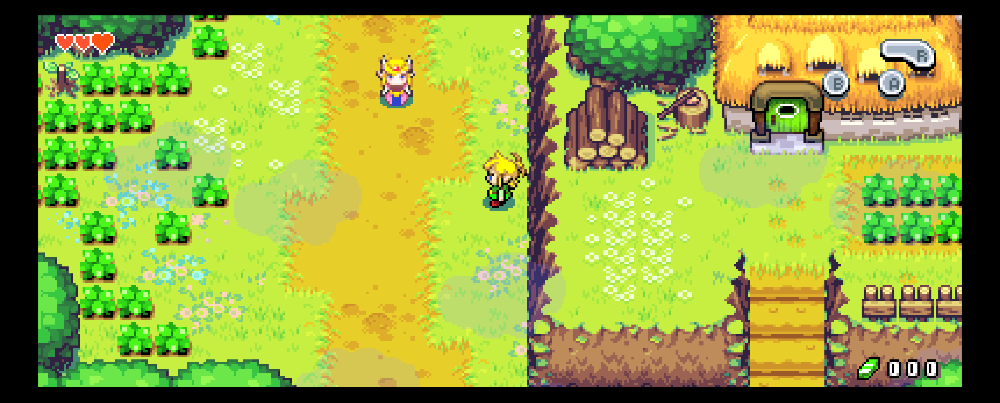
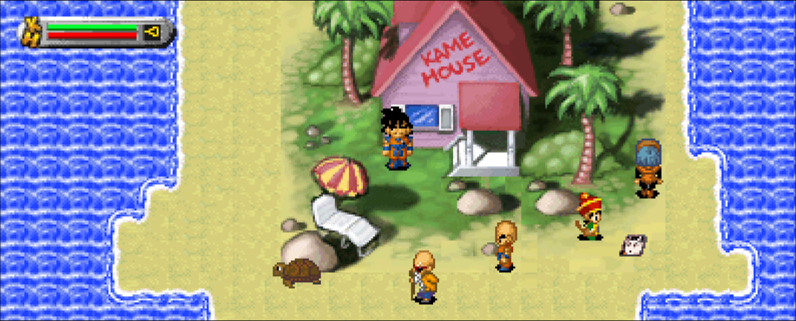
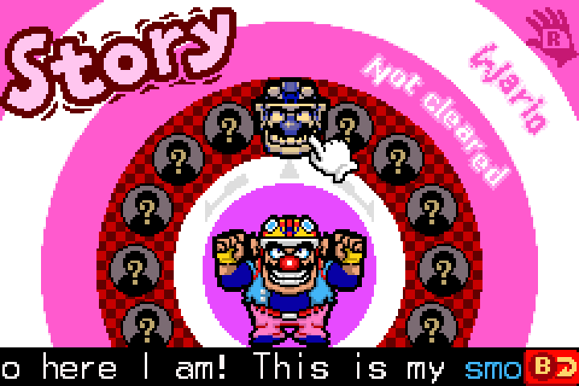
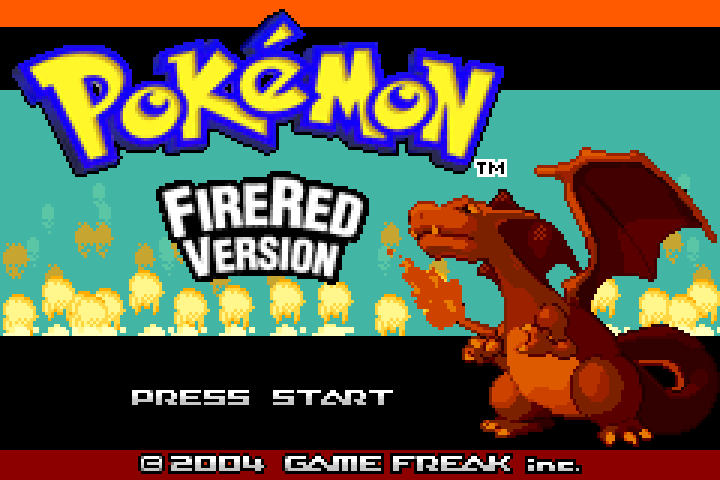
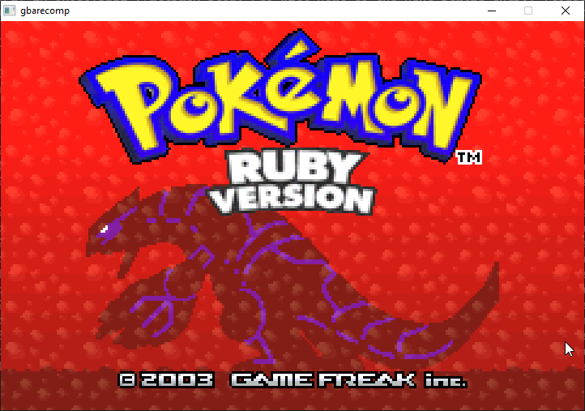
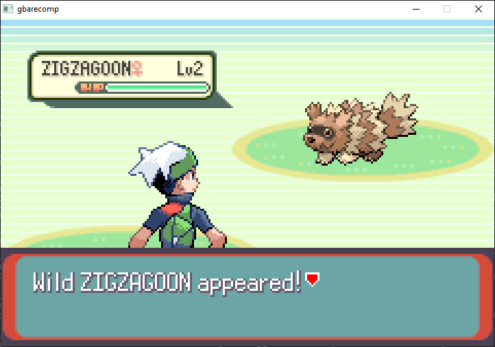
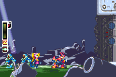
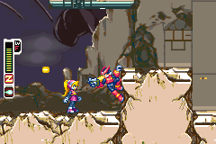

# GBARecomp

**A general-purpose static recompiler for the Game Boy Advance.** GBARecomp
translates ARM7TDMI ARM and Thumb machine code into C++, compiles it into a
native application, and links it against a shared GBA hardware runtime.

The original game logic runs as native code instead of inside a full-system
emulator. The runtime models the hardware around it—including the PPU, audio,
DMA, timers, interrupts, cartridge saves, GPIO devices, and input—and retains a
safe interpreter/self-healing tier for code that cannot yet be resolved
statically.

Projects built on GBARecomp already ship with **adaptive widescreen, versioned
mods, GBA screen color profiles, save states, host-synchronized RTC, modern
motion controls, Android support, and cartridge-specific hardware such as
gyroscopes and solar sensors.**

<table>
  <tr>
    <td width="38%"></td>
    <td width="62%"></td>
  </tr>
  <tr>
    <td align="center"><sub><b>The Minish Cap — faithful 240×160</b></sub></td>
    <td align="center"><sub><b>The Minish Cap — Adaptive Widescreen</b></sub></td>
  </tr>
</table>

These projects are experimental previews and byproducts of developing the
framework. The games are the proving ground; the reusable recompiler and
hardware runtime are the larger goal.

## What it is

GBARecomp turns a supported cartridge into a native recompilation project:

1. The analyzer discovers code, follows control flow, tracks ARM/Thumb
   interworking, and resolves direct and indirect dispatch where it can.
2. The emitter translates discovered functions into portable, sharded C++.
3. A normal C++ compiler builds that output together with the shared GBA
   runtime and game-specific integration.
4. At runtime, unresolved or RAM-installed code can fall through to the
   interpreter and be compiled into a persistent native cache instead of
   becoming a correctness hole.

The original cartridge code still drives the modeled hardware through the same
memory and I/O boundaries used on a GBA. A game project can add presentation
enhancements and narrowly scoped trusted plugins, while the faithful 240×160
path remains available for validation.

GBARecomp is a **framework**, not a collection of ROMs. It does not include a
Nintendo GBA BIOS, game ROMs, generated ROM-derived source, saves, or extracted
game data. Every public build verifies a specific cartridge revision supplied
by the player.

## Adaptive widescreen

Adaptive widescreen is a genuinely wider logical view—not a stretch, crop, or
zoom. As the window or display aspect changes, an opted-in game can grow from
the faithful 240×160 viewport toward its validated maximum while retaining the
original 160-line height.

The framework provides live resize policy, a wider PPU presentation surface,
launcher integration, and validation tools. Each game still owns the parts
only its engine understands: background streaming, room or field boundaries,
actor visibility, sprite clipping, camera policy, menus, and HUD placement.
Unsupported scenes can remain at their authentic width.

<table>
  <tr>
    <td width="38%"></td>
    <td width="62%"></td>
  </tr>
  <tr>
    <td align="center"><sub><b>Faithful 240×160</b></sub></td>
    <td align="center"><sub><b>Adaptive view</b> — same location and character position, more authored world visible.</sub></td>
  </tr>
</table>

The current game integrations demonstrate several different 2D strategies:
authored room buffers in *The Minish Cap*, streamed stage margins in *Mega Man
Zero* and *Super Mario Advance 2*, race presentation in *Mario Kart: Super
Circuit*, and large authored field planes in the three *Dragon Ball Z* games.
The default remains the native GBA view, and the enhanced modes are opt-in.

## Mods

GBARecomp supports opt-in, versioned `.gbamod` packages. Mods are installed and
managed through the shared launcher, can expose multiple independently
toggleable features, and are resolved only against a verified stock ROM.

Packages contain data and manifests, not arbitrary DLLs. Native behavior is
owned by the game, compiled into its executable, and registered under stable
trusted-plugin IDs. The runtime checks the selected ROM, feature dependencies,
conflicts, and required plugins before activation. The player's cartridge image
is never rewritten.

Current public examples include:

- Adaptive Widescreen packages for *The Minish Cap*, *Super Mario Advance 2*,
  *Mario Kart: Super Circuit*, and all three *Dragon Ball Z* games.
- A 60 FPS track-rendering mod for *Mario Kart: Super Circuit*.
- Optional host-clock behavior for *Pokémon Ruby*, *Sapphire*, and *Emerald*.

The package format and game-integration API are documented in
[`docs/MOD_PACKAGES.md`](docs/MOD_PACKAGES.md).

## Cartridge hardware on modern devices

Some of the GBA's most interesting games shipped extra hardware inside the
cartridge. GBARecomp models those devices at their original GPIO and memory
interfaces so the recompiled game still talks to them through its own driver.

| Hardware | Support |
|---|---|
| **Gyroscope + rumble GPIO** | *WarioWare: Twisted!* reads a modeled cartridge gyro. A PlayStation 5 DualSense motion sensor has been tested on Windows; mouse drag is a fallback. Android uses the phone's motion sensor and has been tested on a Galaxy S22 Ultra. The cartridge rumble line is modeled; host vibration support varies by platform. |
| **Solar light sensor** | The Boktai cartridge's photodiode/integrating-ADC protocol is modeled at the GPIO pin level. This is the often-misnamed “IR sensor”: the real device measures visible light. Games can supply live light from a game-owned provider or use manual brightness controls. |
| **S-3511A real-time clock** | RTC cartridges are detected by their SDK signature. The emulated clock is seeded from the host's local civil time at boot, then advances on its own monotonic timeline. Deterministic fixed-time runs are supported for testing. |
| **Matrix Memory mapper** | The 64 MiB *Shrek* GBA Video Movie Pak pages data beyond the normal cartridge window through its original mapper, allowing the complete film to play through the native runtime. |
| **Save hardware** | SRAM, EEPROM, Flash, and 1 Mbit Flash are modeled, with ordinary cartridge saves and separate save-state slots. |

<p align="center">
  
  <br><sub><b>WarioWare: Twisted!</b> — one game consuming GBARecomp's controller and phone gyroscope support.</sub>
</p>

## Android

The runtime supports Android through the SDL application boundary. The first
public Android game build is
[*WarioWare: Twisted!*](https://github.com/mstan/WarioWareTwistedRecomp/releases/tag/android-v0.0.1),
distributed as an experimental arm64 APK with a touch-friendly setup flow,
on-screen controls, phone gyro input, saves, and the shared in-game settings
surface.

Android support is a real framework path, but not yet a blanket release promise
for every game in the catalog. Each title still needs its own packaging and
device validation.

## GBA screen color profiles

Raw digital GBA colors can look different from the LCDs the games were authored
for. The launcher offers five present-time screen models:

| Profile | Presentation |
|---|---|
| **Raw** | Exact BGR555-to-RGB passthrough; the default. |
| **Unlit** | Original reflective panel under dark viewing conditions. |
| **Frontlit** | Front-lit reflective GBA SP-style presentation. |
| **Backlit** | Later backlit panel with cleaner blacks and near-sRGB behavior. |
| **Classic** | Community-familiar gamma/color correction. |

Color conversion is a 32,768-entry lookup applied only to the copy uploaded for
display. It never changes emulated VRAM, the PPU framebuffer used for
verification, or the faithful Raw output.

## Development showcase

<table>
  <tr>
    <td width="50%"><br><sub><b>Pokémon FireRed</b></sub></td>
    <td width="50%"><br><sub><b>Pokémon LeafGreen</b></sub></td>
  </tr>
  <tr>
    <td><br><sub><b>Pokémon Ruby</b></sub></td>
    <td><br><sub><b>Pokémon Sapphire</b></sub></td>
  </tr>
  <tr>
    <td><br><sub><b>Pokémon Emerald</b></sub></td>
    <td><br><sub><b>Pokémon Emerald — gameplay</b></sub></td>
  </tr>
  <tr>
    <td><br><sub><b>Mega Man Zero — opening mission</b></sub></td>
    <td><br><sub><b>Mega Man Zero — gameplay</b></sub></td>
  </tr>
</table>

## Use the released CLI

The CLI generates a recompilation project; it does not turn an arbitrary ROM
into a finished playable port by itself.

1. Open the [GBARecomp Releases](https://github.com/mstan/gbarecomp/releases)
   page.
2. Download `gbarecomp-cli-windows-x86_64.zip` and extract the entire archive.
3. Open PowerShell in that folder and run:

```powershell
.\gbarecomp.exe build `
  --rom "C:\Games\MyGame.gba" `
  --output "C:\Projects\MyGameRecomp"
```

No BIOS is needed to generate source. The output contains sharded C++, runtime
headers, CMake files, and build helpers. To check that the generated static
library compiles:

```powershell
cd "C:\Projects\MyGameRecomp"
.\build.ps1
```

A playable integration still needs verified function coverage, a host
application, cartridge configuration, and game-specific validation. Use one of
the public game repositories below as a reference.

Use only a ROM image you obtained legally. GBARecomp does not copy the input
ROM into the generated project, but generated C++ is derived from it and should
not be redistributed without permission.

## Build the framework

```sh
git clone --recurse-submodules https://github.com/mstan/gbarecomp.git
cd gbarecomp
cmake -S . -B build
cmake --build build
ctest --test-dir build
```

To build the self-contained Windows CLI ZIP, install Python 3.12 and
PyInstaller, then run:

```powershell
py -3.12 -m pip install pyinstaller
py -3.12 tools/build_cli.py
```

The archive is written under `build/cli-release/`.

Cartridge recompilation always emits parallel `recompiled_NNN.cpp` shards. On
Windows, the supplied Clang-MinGW toolchain and automatic ccache/sccache
integration can reduce large clean builds substantially; see
[`docs/BUILD_PERFORMANCE.md`](docs/BUILD_PERFORMANCE.md).

## Architecture

| Path | Purpose |
|---|---|
| `src/armv4t/` | ARM7TDMI decoder, IR, analyzer, interpreter, and C++ code generation. |
| `src/gba/` | Bus, PPU, audio, DMA, timers, IRQ, BIOS, save chips, GPIO, gyro, solar sensor, and RTC. |
| `src/runtime/` | Native dispatch, persistent healing cache, host window/audio/input, launcher seam, mods, and save states. |
| `src/debug/` | TCP debugging, traces, snapshots, differential state, and widescreen validation tools. |
| `tools/` | Scanning, recompilation, symbol import, reference-oracle, CLI, and release tooling. |
| `tests/` | CPU, hardware, runtime, device, mod, and presentation tests. |

The `src/armv4t/` layer is intentionally portable. GBA-specific hardware and
game-specific helpers do not belong in it. Generated C++ is evidence, not
authority: if output is wrong, fix the analyzer/emitter and regenerate rather
than editing generated files.

For the design boundaries and accuracy rules, read
[`docs/ARCHITECTURE.md`](docs/ARCHITECTURE.md). For strict static-coverage
acceptance, set `GBARECOMP_STRICT_STATIC=1`; the first missing static PC then
fails loudly instead of loading or creating a healing shard.

## Public game builds

Each game repository pins a known framework revision, verifies an exact ROM,
and ships its own ROM-free release. These are experimental preservation and
research previews, not finished commercial ports. Back up important saves and
consult each project for its validated revision and current limitations.

| Game | Repository | Highlights |
|---|---|---|
| *Dragon Ball Z: The Legacy of Goku* | [DragonBallZLegacyOfGokuRecomp](https://github.com/mstan/DragonBallZLegacyOfGokuRecomp) | Optional Adaptive Widescreen through 480×160. |
| *Dragon Ball Z: The Legacy of Goku II* | [DragonBallZLegacyofGokuIIRecomp](https://github.com/mstan/DragonBallZLegacyofGokuIIRecomp) | Optional Adaptive Widescreen with widened field planes and actor visibility. |
| *Dragon Ball Z: Buu's Fury* | [DragonBallZBuusFuryRecomp](https://github.com/mstan/DragonBallZBuusFuryRecomp) | Optional Adaptive Widescreen with authored field continuation. |
| *Mario Kart: Super Circuit* | [MarioKartSuperCircuitRecomp](https://github.com/mstan/MarioKartSuperCircuitRecomp) | Optional Adaptive Widescreen and 60 FPS track-rendering mods. |
| *WarioWare: Twisted!* | [WarioWareTwistedRecomp](https://github.com/mstan/WarioWareTwistedRecomp) | Uses GBARecomp's controller and phone gyroscope support; Windows and experimental Android arm64 builds. |
| *Super Mario Advance 2: Super Mario World* | [SuperMarioAdvance2Recomp](https://github.com/mstan/SuperMarioAdvance2Recomp) | Optional scene-aware Adaptive Widescreen. |
| *Super Mario Advance 4: Super Mario Bros. 3* | [SuperMarioAdvance4Recomp](https://github.com/mstan/SuperMarioAdvance4Recomp) | Native gameplay, launcher, controllers, and save states. |
| *Shrek Movie* (GBA Video) | [ShrekGBAVideoRecomp](https://github.com/mstan/ShrekGBAVideoRecomp) | Complete movie playback; 64 MiB Matrix Memory mapper. |
| *Pokémon FireRed* / *Pokémon LeafGreen* | [FireRedLeafGreenRecomp](https://github.com/mstan/FireRedLeafGreenRecomp) | Two verified native targets in one repository. |
| *Pokémon Ruby* / *Pokémon Sapphire* | [RubySapphireRecomp](https://github.com/mstan/RubySapphireRecomp) | Two native targets; Flash1M, RTC, and optional host-clock mod integration. |
| *Pokémon Emerald* | [EmeraldRecomp](https://github.com/mstan/EmeraldRecomp) | Flash1M, RTC, native gameplay, and persistent coverage healing. |
| *The Legend of Zelda: The Minish Cap* | [MinishCapRecomp](https://github.com/mstan/MinishCapRecomp) | Original target; optional Adaptive Widescreen with room-aware margins. |
| *Mega Man Zero* | [MegaManZeroRecomp](https://github.com/mstan/MegaManZeroRecomp) | Static-first gameplay and experimental fixed/adaptive extended views. |

Want to contribute to an existing title or bring up a new one? Start with
[`PRINCIPLES.md`](PRINCIPLES.md), the architecture notes, and a nearby game
project with similar cartridge hardware.

## License

See [`LICENSE`](LICENSE). Nintendo GBA BIOS images, game ROMs, saves, and
extracted game assets remain copyrighted by their respective owners and are
not distributed by this project. Game screenshots and launcher cover art are
used for identification and project documentation.

---

<p align="center">
  <sub><b>R.A.I.D. — Retro AI Development</b> · a Discord for AI-assisted retro reverse-engineering, decomp &amp; recomp</sub>
</p>

<p align="center">
  <a href="https://discord.gg/Ad9BwSzctP"></a>
</p>
